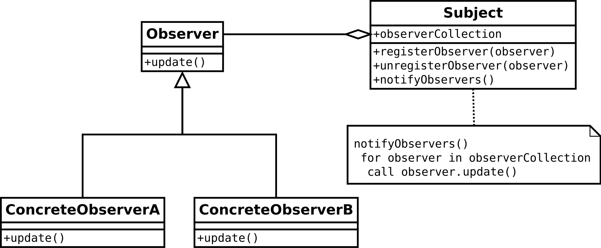
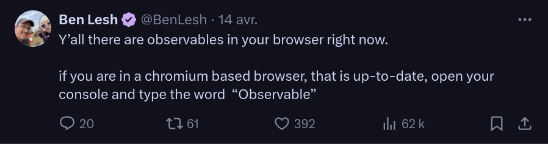
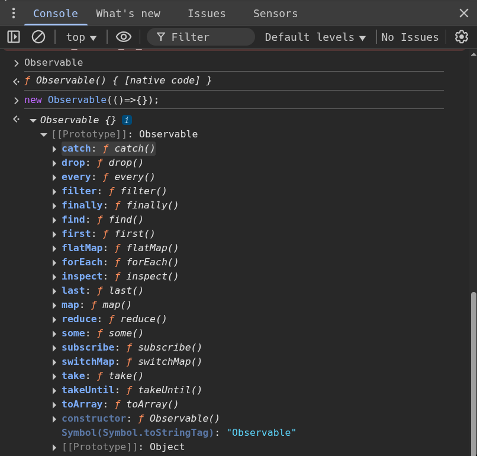
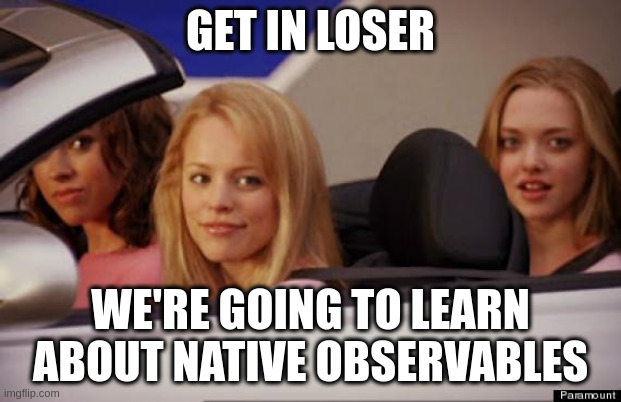
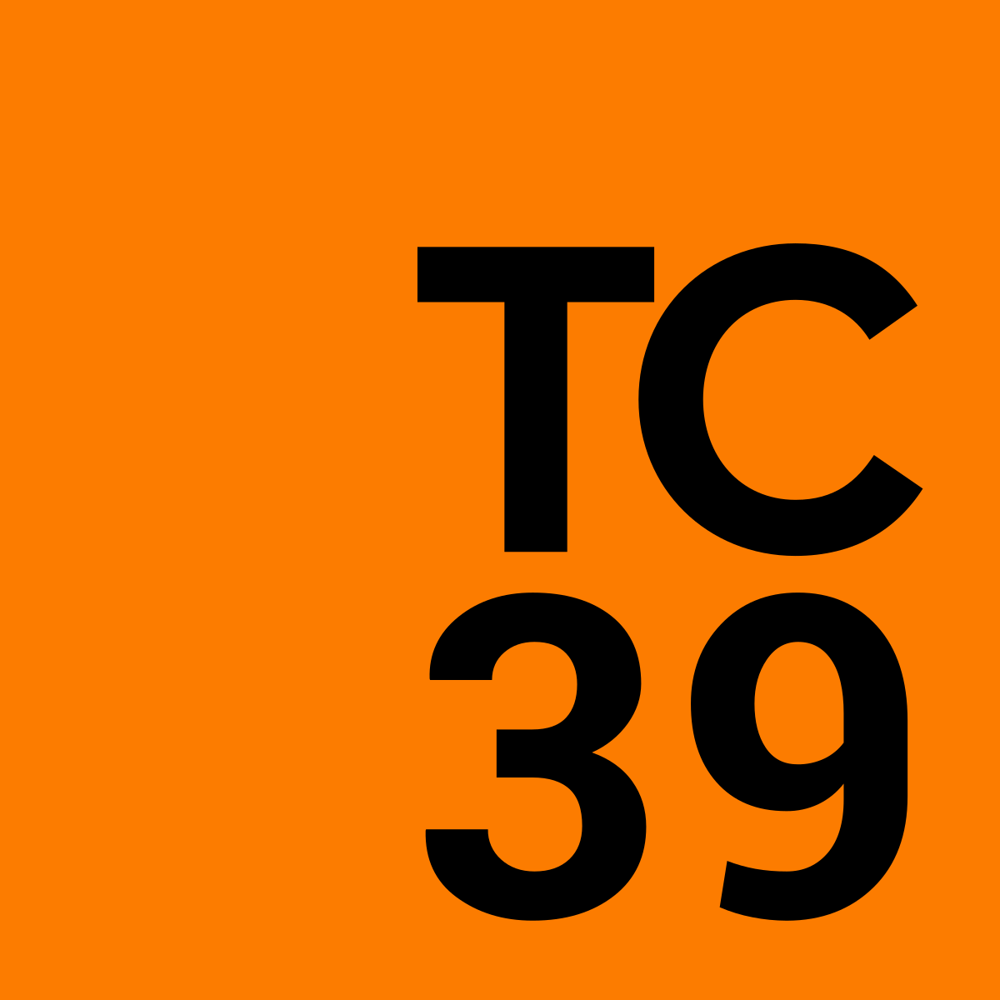
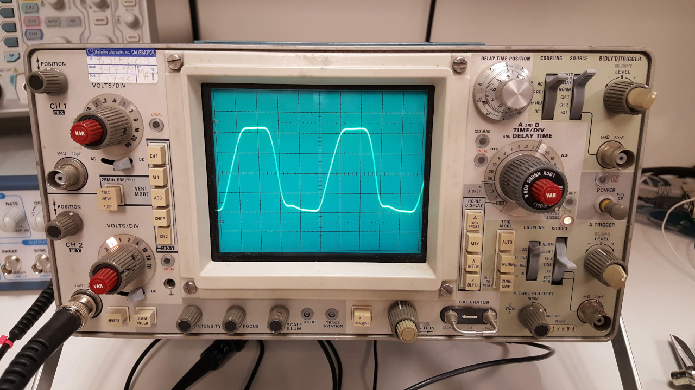
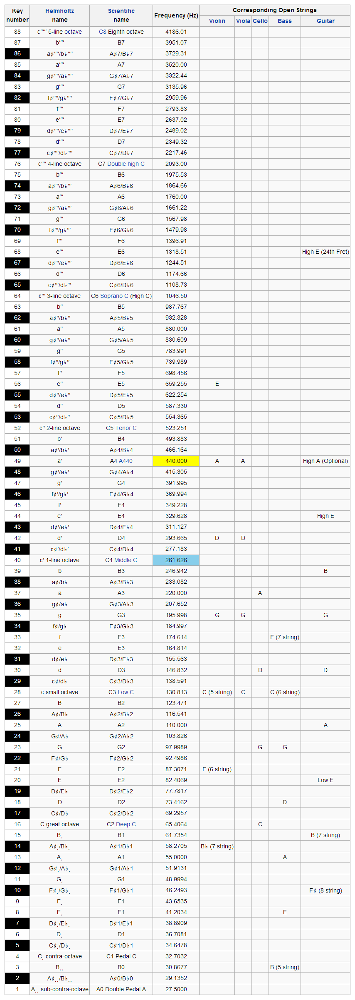
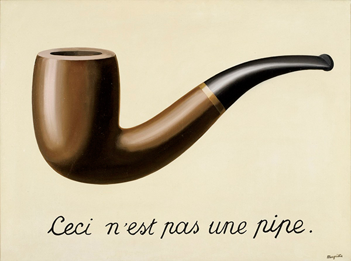

<!-- LTeX: language=fr-FR -->
<div id="sound-test"></div>


<div id="storybook"></div>


<div id="marble-demo"></div>


# Faisons de la musique réactive avec ~~RxJS~~, des Observables et l’API WebAudio 🎧 🎼 🔊 🎛️


## 🔊 Introduction


- Benjamin Legrand<!-- .element class="fragment"-->
- 🧑‍💻Tech lead @ onepoint<!-- .element class="fragment"-->
- 🌐 @benjilegnard<!-- .element class="fragment"-->
- ⌨️ Split keyboards<!-- .element class="fragment"--> 
- 🎸 Musicien<!-- .element class="fragment"-->

Notes:
- Présentation Speaker.
- hobbies: musicien, intéréssant pour ce talk.
- Aujourd'hui je vais vous parler de comment faire de la musique avec des Observables, mais avant...


### 📅 Historique de ce talk


[Making Techno Reactive with RxJS | Max Bendick | ng-conf 2021](https://www.youtube.com/watch?v=gXXW1rqubk0)

Notes:
- Avant, un peu d'historique et SHOUTOUT, l'idée de base n'est pas de moi, Je l'ai piquée à Max Bendick.
- Talk à la ng-conf de 5 minutes en 2021, quand je me suis mis à être speaker, j'ai repensé à ce talk, et à comment j'aimerais beaucoup en faire "ma" version.
- Quand j'ai commencé à travailler sur ce talk, c'était pour enseigner RxJS de manière un peu ludique à mes collègues.
- Sauf que: il s'est passé des choses depuis...
- Je vais vous parler des Observables (ice-breaker: qui dans la salle sait ce que c'est ou en a déjà utilisé ?)


### 🤔 C'est quoi un Observable ?
- Pattern de gestion réactive d'un changement de valeur<!-- .element class="fragment"-->
- "Push", 📢 Producteur -> 👂Consommateur<!-- .element class="fragment"-->
- "Value change as Events"<!-- .element class="fragment"-->

Notes:
- Ce n'est pas nouveau,
- et, c'est basé sur le: Pattern Observer. ( d'où le nom )


### Pattern Observer


Notes:
- Fait partie des 23 designs patterns du gang of four.
- Des gens qui l'ont lu ce bouquin dans la salle ?
- La base de la POO, mais c'est comme clean code: à connaître, mais n'en faite pas une bible.


### Un petit schéma UML


Notes:
- ça c'était la version Java/Objet
- dans le monde javascript, on a une librairie qui s'est vite imposée.
- les termes sont un peu différents


### ReactiveX et RxJS 


[https://reactivex.io/](https://reactivex.io/) & [https://rxjs.dev/](https://rxjs.dev/)

<span class="fragment">Observer</span>
<span class="fragment">+ Iterator</span>
<span class="fragment">+ Functional Programming</span>

Notes:
- basé sur un deuxième pattern du gang of four, l'Itérateur
- Rajoute de notions de Programmation fonctionnelle, notemment par le fait que vous manipuler/combiner avec des fonctions "pures"
- Il y'a d'autres librairies (zen-observable, fate-observable, core-js) mais RxJS est king, because angular


### En JavaScript/TypeScript
| Observer | Observable | Subscription |
|-|-|-|
| next() | constructor() | unsubscribe() |
| error() | of() | closed |
| complete() | from() | |

Notes:
- de l'api de base, vous avez trois objets principaux à connaître
- le principal est au milieu
- Observable, qui encapsule une donnée au fil du temps
- Subscriber: va avoir la logique de : qu'est ce que je fais quand une donnée


### Une fonction vs un callback simple.

```typescript
interface Observable<T> {

    subscribe(
        next: (t: T) => void,
        error?: () => void,
        complete: () => void): Subscription;

    subscribe({
        next: (t: T) => void,
        error?: () => void,
        complete?: () => void
    }): Subscription

    // ...
}
```


### Usage

```typescript
const obs$ = new Observable((obs)=>{
    obs.next(42);
});

const sub = obs$.subscribe((value) => {
  console.log(value);
});

sub.unsubscribe();
```
Notes:
- penser à unsubscribe(), sinon fuite mémoires.
- __Avantages__
- pas d'impératif
- on s'abonne à des données
- on peut "composer" / fusionner des observables
- paresseux: pas d'éxécution tant que pas d'abonnement
- ça reste banger pour manipuler des fonctions au fil du temps


### Méthodes statiques

```TypeScript[|1-3|4-6|7-9]
const abs$ = Observable.of(["a", "b", "c", "d");
abc$.subscribe(console.log);
// "a", "b", "c", "d"
const obs1 = Observable.from(new Observable((obs)=>{obs.next(42)}));
obs2.subscribe(consolelog);
// 42
const obs3$ = Observable.from(Promise.resolve(42));
obs3.subscribe(console.log);
// 42
```
Notes:
- vous avez des méthodes statiques pour créer un observable
- soit depuis un tableau, soit depuis un autre observable


### AsyncIterator
```TypeScript
const asyncIterator = (async function* () {
  yield 1;
  yield 2;
  yield 3;
})();
Observable.from(asyncIterator)
    .subscribe((value)=> {console.log(value);});
// 1
// 2
// 3
```

Notes:
- ce qui est bien c'est que c'est aussi compatible avec les générateurs...
- là si vous avez fait un peu attention et que vous connaissez RxJS vous devez vous être dit : mais c'est pas ça l'API.
- Tu racontes n'importe quoi Benji, oui j'ai menti.


### Et là, c'est le drame :


(Avril 2025 / Chrome 135)

Notes:
- Observable natif disponibles dans la console.
- avant ça ils étaient derrière un flag expérimental à activer

### Effectivement...



### J'ai menti 🤥

Notes:
- du coup je vais pas trop vous parler d'RxJS.
- mais plutôt des Observables natifs
- chrome ils se sont basé sur une proposal...


### TC39 proposal


<https://github.com/tc39/proposal-observable>

Notes:
- comité qui valide les évolutions du language.
- Stage 1 encore
- Stages à expliquer si on à le temps


### Observable natifs

Notes:
- le concept de base est le même
- maintenant qu'on a vu ce qu'était un Observable.
- Posons nous la question, c'est quoi la musique.


## 🕰️ Métronome
Notes:
- Commencons par le commencement.
- Le rythme.


### setInterval

```typescript[|1|2|3-11|6|8-10]
function metronome(interval: number) {
  let counter = 0;
  return new Observable((observer) => {
    const intervalId = setInterval(() => {
      counter++;
      observer.next(counter);
    }, interval);
    return () => {
        clearInterval(intervalId);
    };
  });
}
```

Notes:
- Vous pouvez construire vos propres observables, en passant une méthode au constructeur.
- Ici je mets en place une factory function qui va prendre une durée / intervalle en param.
- en retour du constructeur, on passe une fonction de "nettoyage" appelée lors du complete


### démo métronome

<div id="metronome"></div>

Notes:
- Ici j'ai juste à chaque "tick" une incrémentation du nombre de beat/ou on en est


### BPM: battements par minutes
- Pas suffisant (on ne parle pas en secondes en musique)
- Signature temporelle

```typescript
function bpmToInterval(bpm: number) {
  return (60 / bpm) * 1000;
}
```


### BPM Slider

<div id="bpm-to-interval"></div>

Notes:
- donc la je .map() une valeur vers une autre
- chaque fois que mon Observable en BPM émets
- on le convertit en millisecondes


### écouter un évenement sur un input

```html
<input
    id="bpm-slider"
    type="range"
    min="0"
    max="200"
    value="140"
/>
```


### .when()

```typescript [|2]
getElementById("bpm-slider")
    .when("change")
    .subscribe((bpm) => {
        console.log(bpm);
});
```


### écouter n'importe quel événement parce que:

```typescript
interface EventTarget {
  when(eventName: string): Observable<Event>;
}
```
Notes:
- EventTarget c'est le type qui déclare addEventListener / removeEventListener
- donc dans l'API du DOM, vous allez pouvoir utiliser cette méthode when pour chaque événement.


<div id="bpm-to-interval-with-tick"></div>


### switchMap()

```TypeScript
bpmSlider.when("change")
  .map(bpm => bpmToInterval(bpm))
  .switchMap((interval) => metronome(interval))
  .subscribe(() => {
    // ...
  });
```
Notes:
- avec switchMap, on peut passer d'un observable à un autre.
- ici je recréé un métronome chaque fois que la valeur en bpm change.


### WebAudio: charger un son.
```TypeScript
const audioContext = new AudioContext();
const response = await fetch('sounds/metronome.mp3');
const arrayBuffer = await response.arrayBuffer();
const audioBuffer = await audioContext.decodeAudioData(arrayBuffer);
```

Notes:
- à noter qu'avec l'API webaudio vous devez récupérer un contexte.
- ce contexte doit être créé suite à une action utilisateur (la plupart des browers interdisent l'autoplay
- quelque part lors de l'initialisation de mon écran.


### WebAudio: jouer le son
```TypeScript
metronome$.subscribe(() => {
    const source = audioContext.createBufferSource();
    source.buffer = audioBuffer;
    source.connect(audioContext.destination);
    source.start();
})
```


### WebAudio API
- WebAudio : source / destination
- Connect / Disconnect

Notes:
- j'aurais un talk tout entier pour en parler de cette API
- 


### Feels like this:


Notes:
- l'api est puissante et tout c'est cool, mais c'est un peu comme utiliser un synthétiseur modulaire, on passe son temps à connecter des noeuds.
- bref bon, j'ai un métronome, mais le tic/tac là ça va pas être suffisant.


## 🥁 Rythme / Batterie


### ok j'ai un Métronome, en BPM
- pas suffisant encore
- besoin d'une signature temporelle pour boucler
- temps / 4/8, ternaire, 5/7
- boite à rythme


### Signature temporelle

- 2/4
- 3/4
- 5/4
Notes:
- 


### TR-808


(source: [wikipedia](https://en.wikipedia.org/wiki/Roland_TR-808) )

Notes:
- super machine célèbre des années 80.
- constatez au milieu vous avez l'échelle
- si on essaie de refaire ça...


### conversion time-signature

<div id="bpm-to-time-signature"></div>


### Boite à rythme

<div id="drum-beat"></div>


### Autre Opérateurs 
- `first()`
- `last()`
- `drop()`
- etc...

Notes:
- pourquoi filter ?
- nécéssite que l'observable se complète/termine d'émettre
- et surtout : ça renvoie des promesses.


### différences d'api
- ⚠️ Certaines méthodes renvoient des promesses 🚨


### renvoient un Observable
  - `from()`
  - `to()`
  - `map()`
  - `filter()`
  - `switchMap()`
  - `inspect()`


### renvoient une Promesse

- `first()`
- `last()`
- `every()`
- `toArray()`
- `drop()`
- `flatMap()`
- `reduce()`


### Pourquoi ?

Notes:
- conception par comité.
- Observable de base : pas toutes ces méthodes.


### TC 39


<https://github.com/tc39/proposal-async-iterator-helpers>
Notes:
- les méthodes sur un Observable natif viennent en fait d'une autre proposal au tc-39,
- les utilitaires d'itérateurs asynchrone.


## 🎸 Basse


### OscillatorNode
```TypeScript
const oscillator =  new OscillatorNode();
oscillator.frequency = 440;
oscillator.type = "sine";
oscillator.connect(audioContext.destination);
oscillator.start();
```


### sine wave



Notes:
- son, onde, maths everything is a function


### Theremin

<div id="theremin"></div>

Notes:
- démo
- voyez bien que ca sonne pas super
- ce qu'on pourrait faire...


### Fréquence / Maths


### Fréquence / Maths


### Fréquence / Maths


### wikipedia ?



Notes:
- dans notre culture euro-centrée.
- J'aurais pu mettre en place une map
- mais en fait y'a mieux...


### tonal
```bash
npm install tonal
```

<https://github.com/tonaljs/tonal>

Notes:
- on ne va pas réinventer la roue.
- tonal c'est quoi comme librairie ?


### Théorie musicale:


### Examples
```TypeScript

```

### Démo

à chaque changement de beat: changement de note


## 🎹 Synthétiseur / Accords


### ms-20 tease


### reprendre l'émission initiale, simplifier


### Enveloppe generator


### nappes


### accords 


### théorie musicale
https://www.npmjs.com/package/Tonal


### démo

Contretemps


## Arpèges aléatoires


### Un peu de randomisation, gammes, tonal


### connecter tout ça, il nous manque des pièces


### Math.random()


## Grand final


### Deux minutes max de démo


## Conclusion


### Ce qu'on a vu des Observables natifs
- utilisable sur les objets du DOM natifs (EventTarget)
- juste les briques de base pour l'instant
- multicast par défaut, (rxjs unicast)
- ⚠️ API asynchrone : certains opérateurs retournent des promesses.

Notes:
- pas de behaviorSubject, ReplaySubject, etc...


### Y U NO pipe() ?


Notes:
- pas une API fonctionnelle, plus orienté objet, comme beaucoup d'api du DOM.
- pattern builder, chaînage plutôt que pipe()


### RxJS ?


Notes:
- toujours pertinent, 
- rxjs 8 adoptera peut-être l'API.


### Mauvaise nouvelle.
- C'est toujours en stage 1. <https://www.proposals.es/stages/stage1>
- Chrome uniquement 😠

Notes:
- maintenant soyons sérieux, la musique c'était pour l'example
- si faire de la musique avec du code vous intéresse,


### Si vous voulez faire de la musique avec du code.
- [Tidal Cycles](https://tidalcycles.org/) (Haskell, 2006)
- [Strudel](https://strudel.cc/) (web)

Notes:
- ce que j'ai commencé à développer autour de ça, ça ressemble énormément à un DSL, un domain-specific-language pour faire de la musique.
- et ça existe déjà, notemment pour faire du live-coding.


### Merci

<div class="qr-codes">
  <div class="slides-link">
    <h4>⬇️ Slides ⬇️</h4>
    <a href="https://benjilegnard.github.io/lets-make-music-with-observables/">
      
    </a>
  </div>
  
  <div class="openfeedback-link">
    <h4>⬇️ Feedback ⬇️</h4>
    <a href="https://openfeedback.io/sunnytech2025/2025-06-27/cm7hgps96001ks23nm7cgh1i0">
      
    </a>
  </div>
</div>
