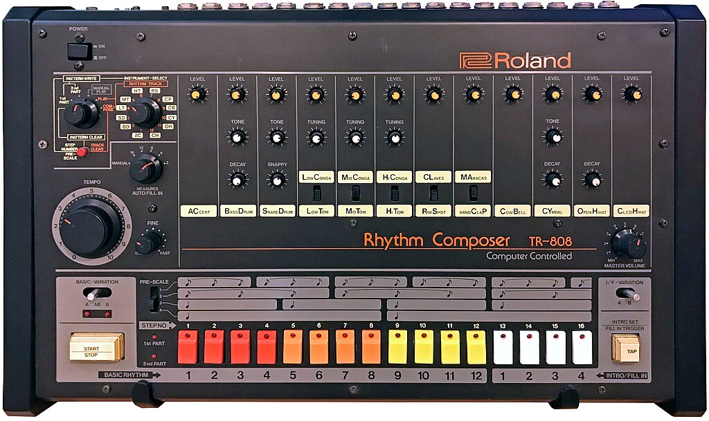

<!-- LTeX: language=fr-FR -->
<div id="sound-test"></div>


# Faisons de la musique réactive avec ~~RxJS~~, des Observables et l’API WebAudio 🎧 🎼 🔊 🎛️


## 🔊 Introduction


- Benjamin Legrand<!-- .element class="fragment"-->
- 🧑‍💻Tech lead @ onepoint<!-- .element class="fragment"-->
- 🌐 @benjilegnard<!-- .element class="fragment"-->
- ⌨️ Split keyboards<!-- .element class="fragment"--> 
- 🎸 Musicien<!-- .element class="fragment"-->

Notes:
- Présentation Speaker.
- hobbies: musicien, intéréssant pour ce talk.
- Aujourd'hui je vais vous parler de comment faire de la musique avec des Observables, mais avant...


### 📅 Historique de ce talk


[Making Techno Reactive with RxJS | Max Bendick | ng-conf 2021](https://www.youtube.com/watch?v=gXXW1rqubk0)

Notes:
- Avant, un peu d'historique et SHOUTOUT, l'idée de base n'est pas de moi, Je l'ai piquée à Max Bendick.
- Talk à la ng-conf de 5 minutes en 2021, quand je me suis mis à être speaker, j'ai repensé à ce talk, et à comment j'aimerais beaucoup en faire "ma" version.
- Quand j'ai commencé à travailler sur ce talk, c'était pour enseigner RxJS de manière un peu ludique à mes collègues.
- Sauf que: il s'est passé des choses depuis...
- Je vais vous parler des Observables (ice-breaker: qui dans la salle sait ce que c'est ou en a déjà utilisé ?)


### 🤔 C'est quoi un Observable ?
- Pattern de gestion réactive d'un changement de valeur<!-- .element class="fragment"-->
- "Push", 📢 Producteur -> 👂Consommateur<!-- .element class="fragment"-->
- "Value change as Events" / temps réèl<!-- .element class="fragment"-->

Notes:
- Ce n'est pas nouveau,
- et, c'est basé sur le: Pattern Observer. ( d'où le nom )


### Pattern Observer


Notes:
- Fait partie des 23 designs patterns du gang of four.
- Des gens qui l'ont lu ce bouquin dans la salle ?
- La base de la POO, mais c'est comme clean code: à connaître, mais n'en faite pas une bible.


### Un petit schéma UML


Notes:
- ça c'était la version Java/Objet
- dans le monde javascript, on a une librairie qui s'est vite imposée.
- les termes sont un peu différents


### ReactiveX et RxJS 


[https://rxjs.dev/](https://rxjs.dev/)
- Observer<!-- .element class="fragment"-->
- Iterator<!-- .element class="fragment"-->
- Functional Programming<!-- .element class="fragment"-->

Notes:
- basé sur un deuxième pattern du gang of four, l'Itérateur
- Rajoute de notions de Programmation fonctionnelle, notemment par le fait que vous manipuler/combiner avec des fonctions "pures"
- Il y'a d'autres librairies (zen-observable, fate-observable, core-js) mais RxJS est king, because angular


### En JavaScript/TypeScript
| Observer | Observable | Subscription |
|-|-|-|
| next() | constructor()<!-- .element class="fragment"--> | unsubscribe() |
| error() | of() | closed |
| complete() | from() | |


Notes:
- de l'api de base, vous avez trois objets principaux à connaître
- Observable, qui encapsule une donnée au fil du temps
- Subscriber: va avoir lalogique de : qu'est ce que je fais quand une donnée


### Une fonction vs un callback simple.

```typescript
interface Observable<T> {
    
    subscribe(onNext: (t: T) => void, onError?: () => void, onComplete: () => void): Subscription;

    subscribe({
        onNext: (t: T) => void,
        onError?: () => void,
        onComplete?: () => void
    }): Subscription

}
```


### Usage

```typescript
const obs$ = new Observable();

const sub = obs$.subscribe((value) => {
  console.log(value);
});

sub.unsubscribe();
```


### Avantages
- pas d'impératif
- on s'abonne à des données
- on peut "composer" / fusionner des observables
- paresseux: pas d'éxécution tant que pas d'abonnement
Notes:
- ça reste banger pour manipuler des fonctions au fil du temps
- là si vous avez fait un peu attention et que vous connaissez RxJS vous devez vous être dit : mais c'est pas ça l'API.


### Et là, c'est le drame :


(Avril 2025 / Chrome 135)

Notes:
- Observable natif disponibles dans la console.
- avant ça ils étaient derrière un flag expérimental à activer


### J'ai menti, monte en voiture loser, on va apprendre les Observables natifs.

Notes:
- du coup je vais pas trop vous parler d'RxJS.
- mais plutôt des Observables natifs


### TC39 proposal

<https://github.com/tc39/proposal-observable>

Notes:
- Stage 1 encore
- Stages à expliquer si on à le temps


### Différences principales
Notes:
- le concept de base est le même
- maintenant qu'on a vu ce qu'était un Observable.
- Posons nous la question, c'est quoi la musique.


## 🕰️ Métronome
Notes:
- Commencons par le commencement.
- Le rythme.


### setInterval

```typescript
function metronome(interval: number) {
  let counter = 0;
  return new Observable((observer) => {
    const intervalId = setInterval(() => {
      counter++;
      observer.next(counter);
    }, interval);
    return () => {
        clearInterval(intervalId);
    };
  });
}
```

Notes:
- Vous pouvez construire vos propres observables, en passant une méthode au constructeur.
- Ici je mets en place une factory function qui va prendre une durée


### démo métronome

<div id="metronome-demo"></div>

Notes:
Ici j'ai juste à chaque "tick" une incrémentation du nombre de beat/ou on en est


### BPM: battements par minutes
- Pas suffisant (on ne parle pas en secondes en musique)
- + Signature temporelle

```typescript
function bpmToInterval(bpm: number) {
  return (60 / bpm) * 1000;
}
```


### BPM Counter


Notes:
- désolé, c'est l'example basique de la réactivité :)


### écouter un évenement sur un bouton
```typescript
getElementById("bpm-plus")
    .when("click")
    .subscribe(() => {
        bpm++;
});
```


### écouter n'importe quel événement parce que:

```typescript
interface EventTarget {
  when(eventName: string): Observable<Event>;
}


### subscribe() + new Sound
// TODO


### WebAudio API
- apparté, la musique pour un ordinateur
- webAudio : source / destination


## 🥁 Rythme / Batterie


### ok j'ai un Métronome
- temps / 4/8, ternaire, 5/7
- boite à rythme


### Signature temporelle
- 2/4
- 3/4
- 5/4


### TR-808



(source: [wikipedia](https://en.wikipedia.org/wiki/Roland_TR-808) )

Notes:
- super machine célèbre des années 80.
- constatez au milieu vous avez l'échelle
- si on essaie de refaire ça...


### switchMap() / filter()


### grosse caisse sur le premier temps


### filter() / modulos


### snare sur le 2e temps


### lire un son


### différences d'api


## 🎸 Basse


### oscillator
- 


### sine wave


### la musique, pour un ordinateur


### des MATHS


### le piano


### notes change


### theremin
<div id="theremin"></div>


### apparté, Tonal.js: abstraction


### apparté Tone.js: au delà de l'api webaudio


### Démo

à chaque changement de beat: changement de note


## 🎹 Synthétiseur / Accords


### ms-20 tease


### reprendre l'émission initiale, simplifier


### Enveloppe generator


### nappes


### accords 


### théorie musicale
https://www.npmjs.com/package/Tonal


### démo

Contretemps


## Arpèges aléatoires


### Un peu de randomisation, gammes, tonal


### connecter tout ça, il nous manque des pièces


### Math.random()


## Grand final


### Deux minutes max de démo


## Conclusion


### Ce qu'on a vu des Observables natifs
- utilisable sur les objets du DOM natifs (EventTarget)
- juste les briques de base pour l'instant
- API Builder-oriented : 
- ⚠️ API asynchrone : certains opérateurs retournent des promesses.


### Y U NO pipe() ?


Notes:
- pas une API fonctionnelle, plus orienté objet.


### RxJS vs Observable natifs.
- à retenir : la base est là, pas l'api rxjs complète
- compatibilité avec les itérateurs asynchrone
- rxjs à terme deviendrait une lib utilitaire


### Mauvaise nouvelle.
- C'est toujours en stage 1. <https://www.proposals.es/stages/stage1>
- Chrome uniquement

- Tests : https://wpt.fyi/results/dom/observable?label=experimental&label=master&aligned 


### Si vous voulez faire de la musique avec du code.
- [Tidal Cycles](https://tidalcycles.org/) (Haskell, 2006, le GOAT)
- [Strudel](https://strudel.cc/) (REPL + version web)

Notes:
- ce que j'ai commencé à développer autour de ça, ça ressemble énormément à un DSL, un domain-specific-language pour faire de la musique.
- et ça existe déjà, notemment pour faire du live-coding.


### Merci

<div class="qr-codes">
  <div class="slides-link">
    <h4>⬇️ Slides ⬇️</h4>
    <a href="https://benjilegnard.github.io/lets-make-music-with-observables/">
      
    </a>
  </div>
  
  <div class="openfeedback-link">
    <h4>⬇️ Feedback ⬇️</h4>
    <a href="https://openfeedback.io/sunnytech2025/2025-06-27/cm7hgps96001ks23nm7cgh1i0">
      
    </a>
  </div>
</div>
